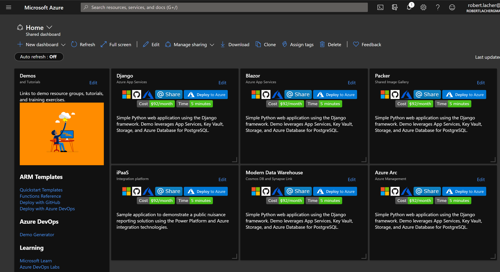

# Azure Dashboards for Demos and Labs

This repo contains the build scripts, JSON configurations, and Azure Dashboard Markdown tiles used to create an Azure Dashboard for labs and demos.

See the [Contribution guide](CONTRIBUTING.md) for how to use or contribute to this repo.

